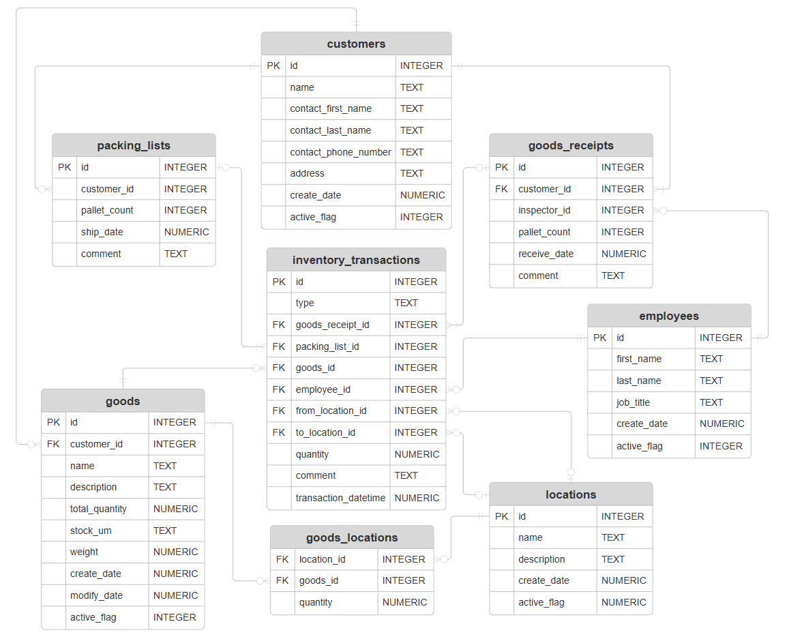

# Design Document

By Miroslav Gencur

Video overview: <https://www.youtube.com/watch?v=pkNcdmNGxiU>

## Scope

The database for the warehouse aims to keep track of inventory transactions and the current stock levels present at each location within the warehouse. This database is targeted at a hypothetical company that provides warehousing services to manufacturers or distributors that do not have sufficient resources, such as warehouse space or personnel. Therefore, customers agree to store their goods in this warehouse, and the goods are then shipped back to them at a later date. As such, the scope of the database includes:

* Inventory transactions that relate to receiving of goods from customers, shipments of goods to customers, and any movements of goods from one warehouse location to another
* Current stock levels at each warehouse location
* Information about goods such as their name, description, unit of measurement, weight, etc.
* Employees that handle inventory transactions and/or inspections of goods
* Customers that place their goods into the warehouse

Out of scope elements include customer orders, invoices, payroll, assets, and other attributes that do not relate to warehousing activities.

## Functional Requirements

This database will support:

* CRUD operations for customers, employees, inventory transactions, warehouse locations, and goods
* Tracking of inventory transactions as well as the accompanying documents, such as goods receipts and packing lists for shipments
* Comments can be added to a document like a goods receipt or an individual inventory transaction

This version of the database allows only a single contact to be associated with a customer. In addition, the database does not provide visibility into the previous job titles employees might have held in cases of promotion at the company.

## Representation

A SQLite database is utilised to capture the entities with the following schema.

### Entities

The following entities are present in the database:

#### Customers

The `customers` table includes:

* `id`, which specifies the ID for each customer. The column is an `INTEGER` type, and the `PRIMARY KEY` constraint is applied. This ensures that SQLite creates the `id` automatically when a new row is inserted.
* `name`, which specifies the company name of the customer as `TEXT`, because this storage class is suitable for name columns. Each customer name must be unique, and it cannot be empty, therefore `UNIQUE` and `NOT NULL` constraints are applied.
* `contact_first_name`, which specifies the first name of the primary contact for a customer company. This field is of the type `TEXT` because of the same reason as `name`. This field is not required.
* `contact_last_name`, which specifies the last name of the primary contact for a customer company. The characteristics of this field are the same as those of `contact_first_name`.
* `contact_phone_number`, which specifies the phone number of the primary contact person. The data is stored as `TEXT` and it is required, thus the `NOT NULL` constraint is applied. Moreover, a `CHECK` constraint is applied to ensure that only text strings longer or equal to 10 characters are accepted as valid input.
* `address`, which specifies the address of a customer is stored as `TEXT`, because it is appropriate for storing strings of text. This information is required, therefore `NOT NULL` constraint is applied.
* `create_date`, which specifies the creation date of the customer record. Timestamps are commonly stored as `NUMERIC` in SQLite. The field is required, so `NOT NULL` constraint is present and the default value is set to the `CURRENT_TIMESTAMP`, which stores the current date and time when the customer record is created.
* `active_flag`, which specifies the current status of the customer, which can either be 'active' - `1` or 'inactive' - `0`. SQLite does not support the boolean type like other DBMS, but the functionality can be replicated with an `INTEGER` that is limited to `0` and `1` by `CHECK` constraint. This allows the database to implement soft deletions, so customers are not deleted from the table, but only flagged as 'inactive'.

#### Employees

The `employees` table includes:

* `id`, which specifies the unique ID of each employee of the company operating the warehouse. This column is `INTEGER` and it has the `PRIMARY KEY` constraint applied.
* `first_name`, which specifies the employee's first name that is stored `TEXT`, because it is suitable for strings.
* `last_name`, which specifies the employee's last name. Similarly to the `first_name`, the data is stored as `TEXT`.
* `job_title`, which specifies the job title of each employee. This column stores strings of text, thus the `TEXT` storage class is appropriate.
* `create_date`, which specifies the create date of the employee record is stored as `NUMERIC`. The field is auto-populated with the current date and time, which is specified by `DEFAULT CURRENT_TIMESTAMP`.
* `active_flag`, which specifies the current status of each employee as an `INTEGER`. The field is limited to `0` and `1` by the `CHECK` constraint.

All columns in the `employees` table are required and hence should have the `NOT NULL` constraint applied.

#### Goods receipts

The `goods_receipts` table includes:

* `id`, which specifies a unique ID for each goods receipt as an `INTEGER`. This field has the `PRIMARY KEY` constraint applied.
* `customer_id`, which specifies the ID of the customer on the goods receipt. This column has the `FOREIGN KEY` constraint that references the `id` column in the `customers` table. The storage class is `INTEGER` as it needs to match `id` in the `customers` table. Foreign keys can contain the value of `NULL` by default, as specified in the SQLite documentation at <https://www.sqlite.org/foreignkeys.html>. It is required to specify a customer for each goods receipt record, thus `NOT NULL` constraint is applied.
* `inspector_id`, which specifies the ID of the employee responsible for the inspection of a shipment of goods. This field is also `INTEGER` and it has `FOREIGN KEY` constraint applied.
* `pallet_count`, which specifies the number of pallets that the goods are shipped on. This data is stored as `INTEGER` because decimal values are not allowed.
* `receive_date`, which specifies the date of delivery of goods into the warehouse as `NUMERIC`. The default value is set to the current timestamp, as denoted by `DEFAULT CURRENT_TIMESTAMP`.
* `comment`, which specifies comment and allows employees to add notes to individual shipments as `TEXT`.

All columns in the `goods_receipts` table are required and hence should have the `NOT NULL` constraint applied except for the `comment` column, which is optional.

#### Packing lists

The `packing_lists` table includes:

* `id`, which specifies the unique ID of each packing list document as an `INTEGER`. This column has the `PRIMARY KEY` constraint.
* `customer_id`, which specifies the customer from the `customers` table as an `INTEGER`. The field has the `FOREIGN KEY` constraint because it references the `id` from `customers` table.
* `pallet_count`, which specifies the number of pallets used for the shipment of goods as `INTEGER` because the value must be a whole number.
* `ship_date`, which specifies the date of shipment on the packing list record as `NUMERIC`. The default value for the field is the current timestamp, which is specified by `DEFAULT CURRENT_TIMESTAMP`.
* `comment`, which specifies a comment or a note that can be associated with a packing list. Since the data stored is a string, the data storage class used is `TEXT`.

All columns in the `packing_lists` table are required and hence should have the `NOT NULL` constraint applied except for the `comment` column, which is optional.

#### Goods

The `goods` table includes:

* `id`, which specifies the unique ID for the goods as an `INTEGER`. This column thus has the `PRIMARY KEY` constraint applied.
* `customer_id`, which specifies the customer ID of customer that owns the goods. The field is stored as `INTEGER` and it has the `FOREIGN KEY` constraint applied.
* `name`, which specifies the name of each stock item in the warehouse as `TEXT`. Each stock item needs to have a unique name, thus `UNIQUE` constraint is applied.
* `description`, which specifies the description of each stock item as `TEXT`. This text value is expected to be longer than `name`.
* `total_quantity`, which specifies the total quantity of the stock item in the warehouse. The value is stored as `NUMERIC` because depending on the unit of measurement, the values can be integers or decimal values. The value of this field cannot be negative, thus `CHECK` constraint is applied to only allow quanity of `0` or higher.
* `stock_um`, which specifies the stock unit of measurement as `TEXT`. The `CHECK` constraint limits the valid entries to the following units of measurement - `PCS` (pieces), `KG` (kilogrammes), `MTR` (metres), `LTR` (litres), `BOX` (boxes). The default value is specified as `PCS`.
* `weight`, which specifies the weight of each stock item in kilogrammes per unit of measurement. The value is stored as `NUMERIC` and it contains a `CHECK` constraint that requires the value to be higher than `0`.
* `create_date`, which specifies the date when a stock item is created as `NUMERIC`. The default value is set to the current timestamp by `DEFAULT CURRENT_TIMESTAMP`,
* `modify_date`, which specifies the last date a record was modified. The characteristics of this field are the same as `create_date`.
* `active_flag`, which specifies the status goods as `INTEGER`. This field allows 'soft deletions' of goods from the table. The values are limited by the `CHECK` constraint to `0` - inactive and `1` - active.

All columns in the `goods` table are required and hence should have the `NOT NULL` constraint applied except for the `description` column, which is optional.

#### Locations

The `locations` table includes:

* `id`, which specifies the unique ID for the location as an `INTEGER`. This column thus has the `PRIMARY KEY` constraint applied.
* `name`, which specifies the name of the location as `TEXT`. Each entry must be unique, thus the `UNIQUE` constraint is applied.
* `description`, which specifies the description of each location as `TEXT`.
* `create_date`, which specifies the create date of each location in the warehouse as `NUMERIC`. The column has a default value of `CURRENT_TIMESTAMP`.
* `active_flag`, which specifies the status of the location as `INTEGER`. This allows the table to flag a location as 'inactive', if it is no longer in use. The values are limited to `0` and `1` by the `CHECK` constraint.

All columns in the `locations` table are required and hence should have the `NOT NULL` constraint applied except for the `description` column, which is optional.

#### Goods at locations

The `goods_locations` table includes:

* `location_id`, which specifies the location ID as `INTEGER`. This column has a `FOREIGN KEY` constraint as it references the `id` from the `locations` table.
* `goods_id`, which specifies the ID of the stock item as `INTEGER`. This field has a `FOREIGN KEY` constraint and it references the `id` column from the `goods` table.
* `quantity`, which specifies the quantity of each stock item in a warehouse location. The values are set to `NUMERIC` and they have a `CHECK` constraint that forbids negative values. A new record is only entered into this table when goods are received into the warehouse for the first time. If the stock is moved, then the quantity might become `0`, but it can never become negative.

Fields `location_id` and `goods_id` form a composite `PRIMARY KEY`. The table aims to serve as a 'junction' table between `goods` and `locations` tables. All columns in the `goods_locations` table are required, thus the `NOT NULL` constraint is applied.

#### Inventory transactions

The `inventory_transactions` table includes:

* `id`, which specifies the unique ID for the transaction as an `INTEGER`. This column thus has the `PRIMARY KEY` constraint applied.
* `type`, which specifies the type of inventory transaction as `TEXT`. This field is limited by the `CHECK` constraint to values `IN`, `OUT`, and `MOVE`.
* `goods_receipt_id`, which specifies the ID of the referenced goods receipt document as `INTEGER`. The 'FOREIGN KEY` constraint is applied to this column as it references the `id` column from the `goods_receipts` table. A `CHECK` constraint ensures that a value is not empty if the `type = 'IN'`.
* `packing_list_id`, which specifies the ID of the referenced packing list document as an `INTEGER`. The field has a `FOREIGN KEY` constraint as it references the `id` from the `packing_lists` table. A `CHECK` constraint ensures that a value is not empty if the `type = 'OUT'`.
* `goods_id`, which specifies the stock item ID as an `INTEGER`. The field has a `FOREIGN KEY` constraint as it references the `id` from the `goods` table.
* `employee_id`, which specifies the employee that performs the inventory transaction as an `INTEGER`. The field has a `FOREIGN KEY` constraint as it references the `id` from the `employees` table.
* `from_location_id`, which specifies the location ID where stock levels are reduced during shipments from the warehouse and stock movements. The field has a `FOREIGN KEY` constraint as it references the `id` column in the `locations` table. A `CHECK` constraint ensures that the field is not empty if the transaction `type` is either `OUT` or `MOVE`.
* `to_location_id`, which specifies the location ID where stock levels are increased during receiving of stock into the warehouse or stock movements. The field has a `FOREIGN KEY` constraint as it references the `id` column in the `locations` table. A `CHECK` constraint ensures that the field is not empty if the transaction `type` is either `IN` or `MOVE`.
* `quantity`, which specifies the quantity as `NUMERIC`. The `CHECK` constraint makes sure that only values higher than `0` can be entered.
* `comment`, which specifies a comment or a note that can be supplied with a transaction as `TEXT`.
* `transaction_datetime`, which specifies the transaction date and time of the transaction as `NUMERIC`. The default value is set to `CURRENT_TIMESTAMP`.

The following attributes of the `inventory_transactions` table have the `NOT NULL` constraint applied: `type`, `goods_id`, `employee_id`, `quantity`, and `transaction_datetime`.

### Relationships

The entity relationship diagram below shows the relationships among the entities in the database.

As per der diagram:

* `customers` one-to-many `goods_receipts` - A customer needs to send goods to the warehouse in 1 or more shipments, therefore there is a one-to-many relationship between customers and goods receipts. A company is considered to be a customer when a goods receipt is first created. Each goods receipt must be linked to only 1 customer.
* `customers` one-to-many `goods` - A customer is associated with 0 to many goods. Each stock item needs to contain a reference to a single customer.
* `goods_receipts` one-to-many `inventory_transactions` - A goods receipt contains 1 or more stock items to be stored in the warehouse, which are turned into 1 or more inventory transactions. (Each goods receipt line item is transferred into the warehouse using a single inventory transaction). An inventory transaction optionally references a single goods receipt document, as there are other possible inventory transaction types that can take place.
* `employees` one-to-many `goods_receipts` - An employee can act as the inspector on a goods receipt 0 to many times. If a person can become an employee without having to act as an inspector. Each goods receipt document must referece 1 employee.
* `employees` one-to-many `inventory_transactions` - An employee can perform 0 to many inventory transactions. Somebody can become an employee at the company without yet performing any inventory transactions. An inventory transaction must be performed by 1 employee.
* `locations` one-to-many `inventory_transactions` - A location can be referenced inside an inventory transaction as either an inbound location or an outbound location. A location is used 0 to many times in inventory transactions. If a location is created in the database, it might not be immediately linked to a inventory transaction. If a transaction relates to an inbound movement of stock with a goods receipt, then `to_location_id` must be specified. If a transaction relates to an outbound movement of stock with a packing list, then `from_location_id` must be specified. If a transaction relates to an inter warehouse movement, then both `from_location_id` and `to_location_id` must be specified. Each inventory transaction only references a single inbound location and/or a single outbound location.
* `locations` many-to-many `goods` - A warehouse location can contain 0 to many goods and a single stock item can be found in 0 to many warehouse locations. Therefore, a 'junction table' is implemented in the database. Each stock item at a particular warehouse location will have a quantity associated.
* `goods` one-to-many `inventory_transactions` - A stock item must be present in at least 1 inventory transaction, however it can be associated with many inventory transactions. An inventory transaction must reference 1 stock item.
* `packing_lists` one-to-many `inventory_transactions` - A packing list contains 1 or more stock items to be shipped from the warehouse, which are turned into 1 or more inventory transactions. (Each packing list line item is transferred from the warehouse using a single inventory transaction). An inventory transaction optionally references a single packing list document.
* `customers` one-to-many `packing_lists` - A customer can have their goods shipped from the warehouse 0 to many times. If the customer decides to have their goods stored in the warehouse, no packing list has been created that would reference them at that time. Each customer can also have their goods shipped several times. A packing list must contain a single customer.

## Optimizations

#### Indexes
Per the typical queries in `queries.sql`, it is common to search for the transactions performed by employees to compare the performance of employees. For that reason, an index was created for the `first_name` and `last_name` in the `employees` entity.

Similarly, the company might need to know which goods belong to which customer, therefore an index was created on the `name` in the `customers` table and the `name` field of the `goods` entity.

Lastly, determining the current stock values at a particular location requires searching the `name` of the `locations` table, thus an index was created there as well.

#### Views
Database views are created for `customers`, `employees`, `locations`, and `goods` tables. Each of them retrieves the records that are marked as 'active' in the `active_flag` field in each respective table.

## Limitations

* Only three types of transactions are currently supported. Transactions, such as 'make adjustment' might be needed in cases of discrepancies that can arise during stock checks.
* It is assumed that each goods receipt line item and each packing list item result in a single inventory transaction.
* A company could potentially have multiple contacts, however the current design only allows for a single contact per customer.
