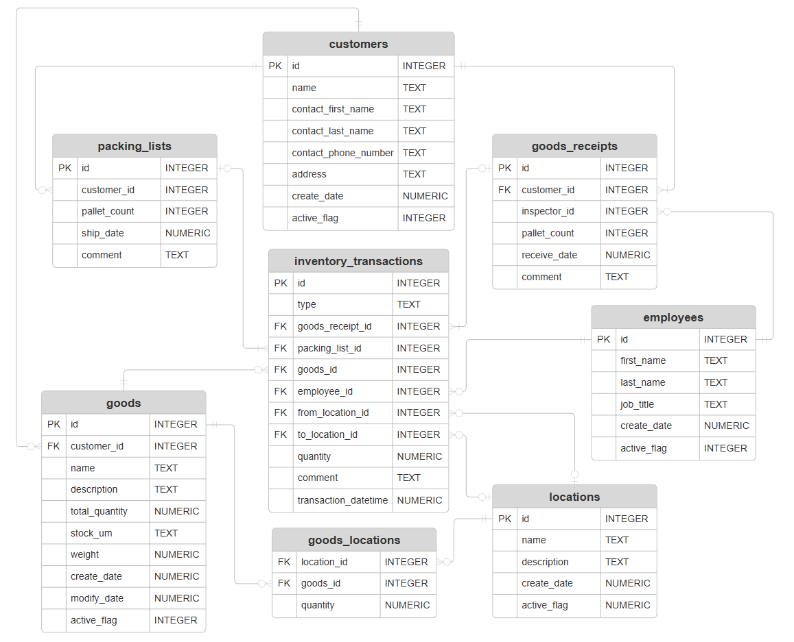

# CS50 SQL - Final Project
The task of the final project for CS50 SQL course was to design a database. (All instructions on https://cs50.harvard.edu/sql/2024/project/)

## Files in the project:

### [_DESIGN.md_](/DESIGN.md)
Describes the database's purpose, scope, entities, relationships, optimizations, and limitations.

### Entity Relationship diagram:

### schema.sql
SQLite3 database schema, which is comprised of `CREATE TABLE`, `CREATE INDEX`, `CREATE VIEW` and `CREATE TRIGGER` statements.

### queries.sql
Statements that users would commonly run on the database, e.g. `INSERT`, `UPDATE`, `SELECT` and `DELETE` statements.

### warehouse.db
SQLite3 Database file.
